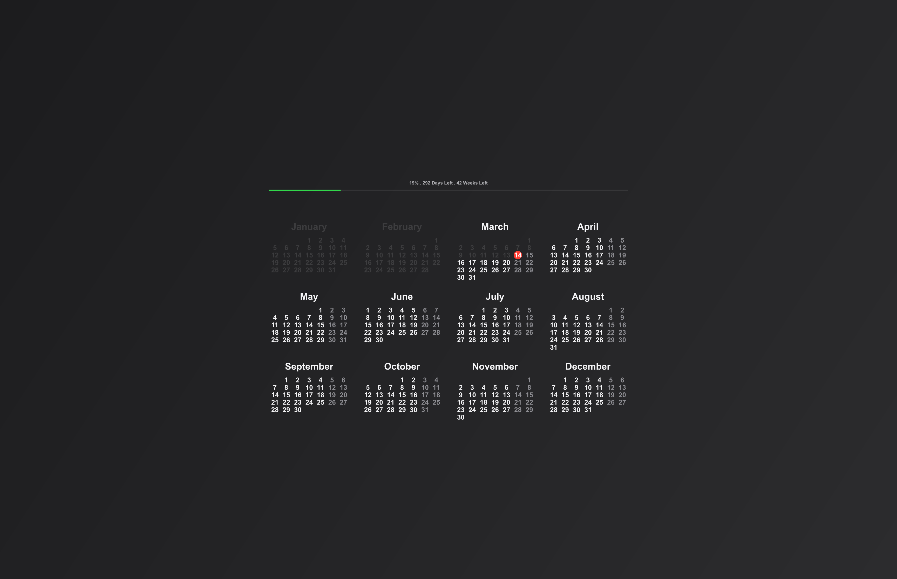

#  WallCal: Dynamic Calendar Wallpaper

[](https://github.com/Rahulsharma0810/WallCal/actions/workflows/generate-wallpaper.yml)


A high-resolution, minimal dynamic calendar wallpaper for macOS. It features a full-year calendar with automated "spent" date greying, year progress tracking, and an optimized layout to clear the macOS lock screen clock and UI.

---

## 🎨 Preview



---

## ✨ Features

- **Daily Automation**: GitHub Actions generates the latest wallpaper every night before 00:00 UTC.
- **Smart Calendar**: Automatically highlights today's date and "greys out" past months and days.
- **Year Progress**: A subtle progress bar showing the percentage of the current year completed.
- **Retina Ready**: High-resolution output optimized for MacBook Pro 14/16" screens.
- **Zero Dependencies (Local)**: No external APIs like Unsplash; uses pure `node-canvas` for speed and reliability.
- **Lock Screen Compatible**: Specifically aligned to sit perfectly between the clock and login profile on macOS.

---

## 🚀 Setup & Usage

### 1. The Easy Way (macOS Shortcut)
The simplest way to use WallCal is to install the pre-made macOS Shortcut. It automatically pulls the latest generated image from this repository and sets it as your wallpaper.

- **Download Shortcut**: [WallCal macOS Shortcut](https://www.icloud.com/shortcuts/9387958196a747d4b3ead407f23d69f9)
- **Schedule**: Set this shortcut to run daily at **00:01 AM** using a "Time of Day" automation in the Shortcuts app.

### 2. Manual Generation (Local)
If you prefer to generate wallpapers locally and customize the code:

Requires [Node.js](https://nodejs.org/) and `npm`.

```bash
git clone https://github.com/Rahulsharma0810/WallCal.git
cd WallCal
npm install
node mac-wallpaper.js
```

---

## 🛠 Configuration

Edit `mac-wallpaper.js` to customize colors, fonts, or layout:

```javascript
const CONFIG = {
  WIDTH: 3456,
  HEIGHT: 2234,
  BG_COLOR_START: "#1c1c1e",
  BG_COLOR_END: "#2c2c2e",
  // ... more settings
};
```

---

## 📅 Roadmap

- [x] **macOS**: Full-year calendar with year progress.
- [ ] **iPhone**: Vertical layout optimized for iOS widgets/lockscreen.
- [ ] **iPad**: Tablet-optimized landscape/portrait grid.
- [ ] **Custom Themes**: Support for light mode and varied gradients.

---

## 📝 License

MIT © [Rahul Sharma](https://github.com/rahulvsharma)
