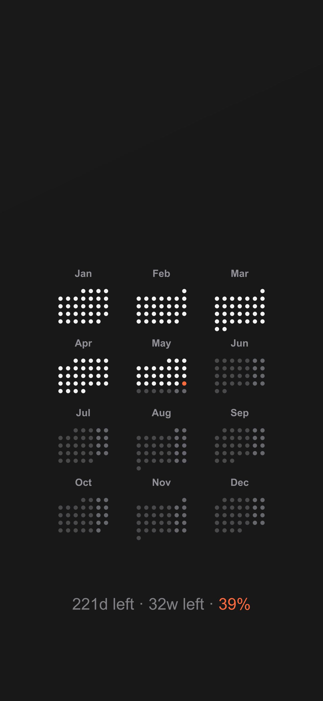
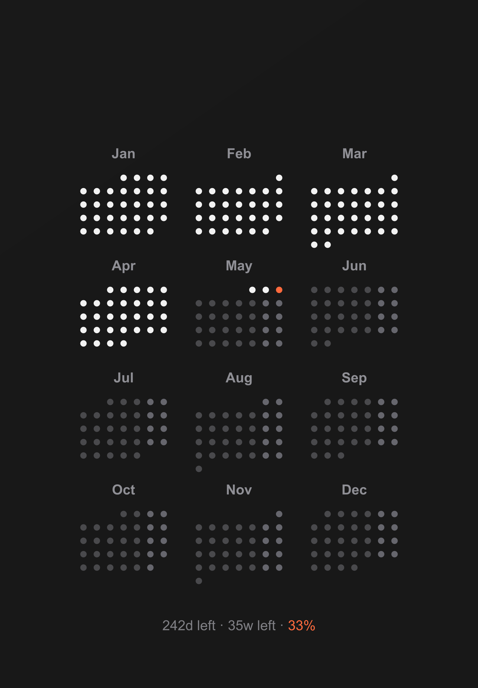
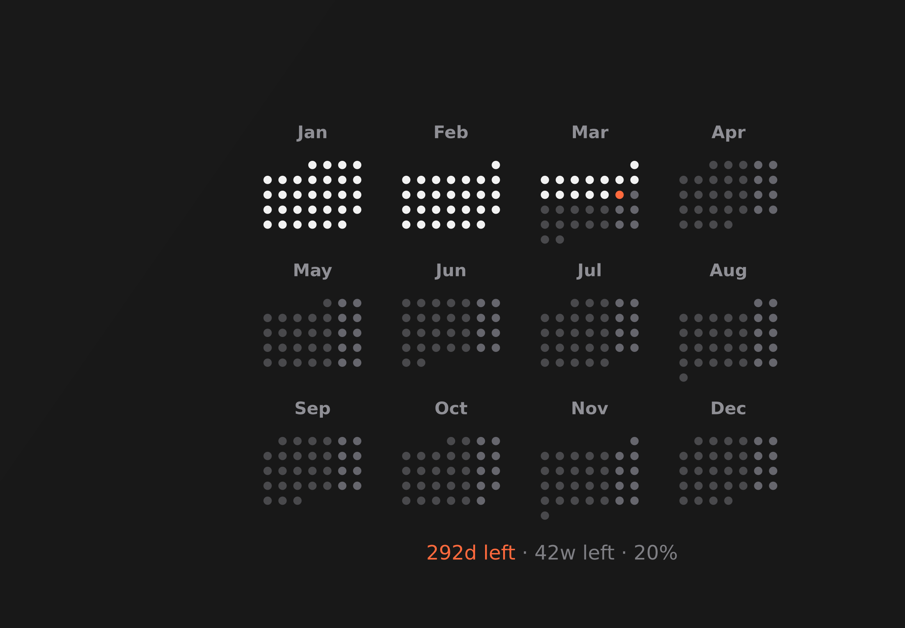

#  WallCal: Dynamic Calendar Wallpapers

[](https://github.com/Rahulsharma0810/WallCal/actions/workflows/generate-wallpaper.yml)


A high-resolution, minimal set of dynamic calendar wallpapers for iPhone, iPad, and Mac. It features full-year dot calendars, automated past-day greying, year progress tracking, and device-specific layouts tuned for clean wallpaper composition.

---

## 🎨 Preview






---

## ✨ Features

- **Daily Automation**: GitHub Actions generates the latest wallpapers every night before 00:00 UTC.
- **Smart Calendar**: Automatically highlights today's date and "greys out" past months and days.
- **Year Progress**: Shows days left, weeks left, and year completion percentage.
- **Multi-Device Support**: Generates wallpapers for iPhone, iPad portrait, iPad landscape, and Mac.
- **Retina Ready**: High-resolution output tuned for current device targets.
- **Zero Dependencies (Local)**: No external APIs like Unsplash; uses pure `node-canvas` for speed and reliability.
- **Shared Renderer**: Common theme, validation, and rendering helpers keep platform outputs consistent.

---

## 🚀 Setup & Usage

### 1. The Easy Way (macOS Shortcut)
The simplest way to use WallCal is to install the pre-made macOS Shortcut. It automatically pulls the latest generated image from this repository and sets it as your wallpaper.

- **Download Shortcut**: [WallCal macOS Shortcut](https://www.icloud.com/shortcuts/9387958196a747d4b3ead407f23d69f9)
- **Schedule**: Set this shortcut to run daily at **00:01 AM** using a "Time of Day" automation in the Shortcuts app.

### 2. Manual Generation (Local)
If you prefer to generate wallpapers locally and customize the code:

Requires [Node.js](https://nodejs.org/) and `npm`.

```bash
git clone https://github.com/Rahulsharma0810/WallCal.git
cd WallCal
npm install
npm run generate:all
npm run verify
```

Generate a single target when you only want one device:

```bash
npm run generate:iphone
npm run generate:ipad
npm run generate:ipad-landscape
npm run generate:mac
```

### 3. Device Matrix

See [DEVICES.md](/workspaces/WallCal/DEVICES.md) for the current platform targets, resolutions, output files, and local commands.

---

## 🛠 Configuration

Edit the platform configs under `configs/` to customize colors, fonts, or layout:

```javascript
const CONFIG = {
  width: 3456,
  height: 2234,
  gradientColors: ["#191919", "#181818", "#181818"],
  // ... more settings
};
```

Shared colors, fonts, and month labels live in `lib/wallpaper-theme.js`. Shared drawing and output logic live in `lib/wallpaper-renderer.js`.

Platform generator entrypoints live under `generators/`, shared logic under `lib/`, validation and device configs under `configs/`, and local utility scripts under `scripts/` and `tests/`.

Current platform configs:
- `configs/iphone.js`
- `configs/ipad-portrait.js`
- `configs/ipad-landscape.js`
- `configs/mac.js`

---

## 📅 Roadmap

- [x] **macOS**: Full-year dot-calendar wallpaper.
- [x] **iPhone**: Vertical dot-calendar wallpaper.
- [x] **iPad**: Portrait and landscape wallpaper generators for iPad Air 11-inch (M2).
- [ ] **Custom Themes**: Support for light mode and varied gradients.

---

## 📝 License

MIT © [Rahul Sharma](https://github.com/rahulvsharma)
